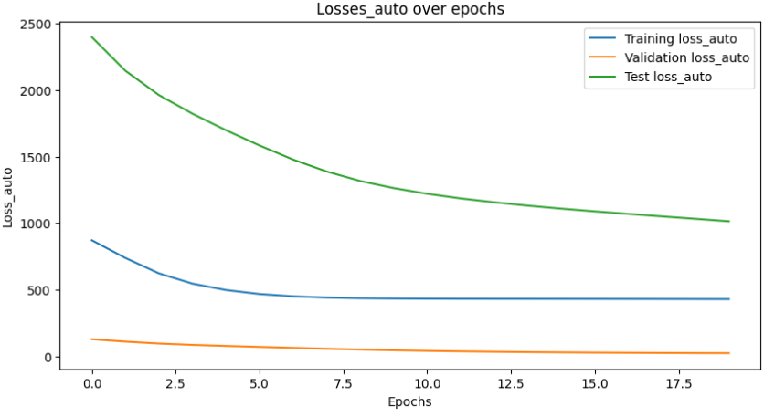
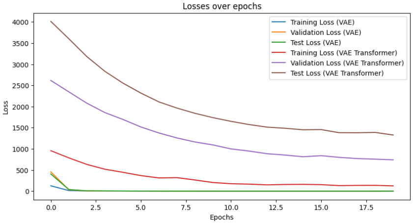
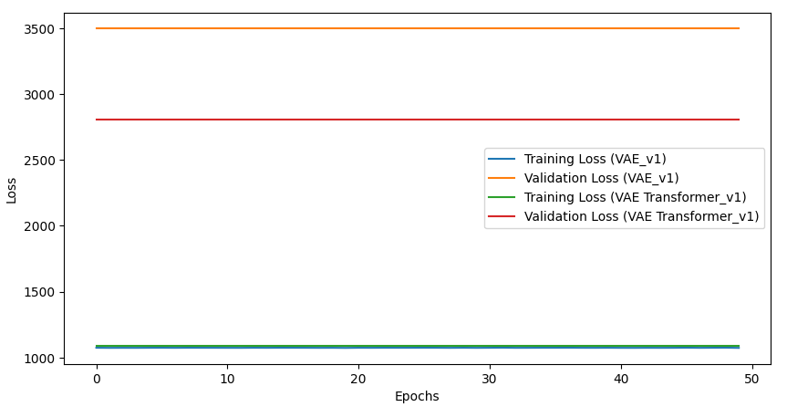
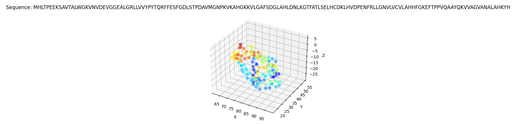
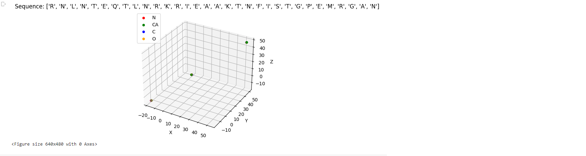

# ProtVAE
#[End-to-End deep structure generative model for protein design]((https://www.biorxiv.org/content/10.1101/2022.07.09.499440v1.full.pdf))

Paper Author 1: Boqiao Lai, Paper Author 2: Matt McPartlon, Paper Author 3: Jinbo Xu

*2022*

This folder provides a re-implementation of this paper in PyTorch, developed as part of the course METU CENG 796 - Deep Generative Models. The re-implementation is provided by:
* Seyit Semih Yiğitarslan, e265507@metu.edu.tr

Please see the jupyter notebook file [main.ipynb](main.ipynb) for a summary of paper, the implementation notes and our experimental results.

You can download the dataset using the [download_data.sh](download_data.sh) script
